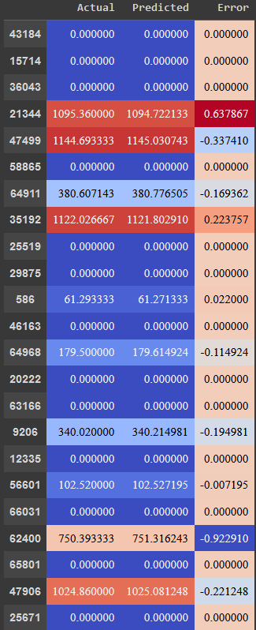

# pe-solar-power-forecasting
Состав команды:
- Вячеслав Руссу РИМ-130908
- Исмедлаев Игорь РИМ-130906
- Артём Мухаметгалиев РИМ-130906

Задача — прогнозирование выработки энергии солнечной станции
--
Модель - https://www.kaggle.com/code/pythonafroz/solar-power-generation-forecast-with-99-auc
--
Блокнот проекта — https://colab.research.google.com/drive/1HgYjUxuryEACezvEbvdvNjPeHhP06gEo?usp=sharing
--
В качестве задачи было выбрано прогнозирование выработки электрической энергии солнечной станцией. Данная тема также актуальна для нас в рамках проектного практикума.
Решение представлено в виде блокнота на платформе Google Colab в виде одного скрипта (первый блок в блокноте) и в виде поэтапного разбиения с выводом графической информации о данных (остальные блоки после первого).
Разбор и решение задания проводились командой совместно в ходе очных и онлайн встреч.

---

Для прогнозирования используются данные о выработке солнечной энергии и данные о погоде для солнечных установок, такие как температура окружающей среды, температура модуля станции, облучение, общая и ежедневная выработка.
Были использованы методы:
- LinearRegression
- RandomForestRegressor 
- DecisionTreeRegressor 

На выходе получены данные о прогнозе мощности выработки солнечной энергии в сравнении с данными о реальной выработке.

